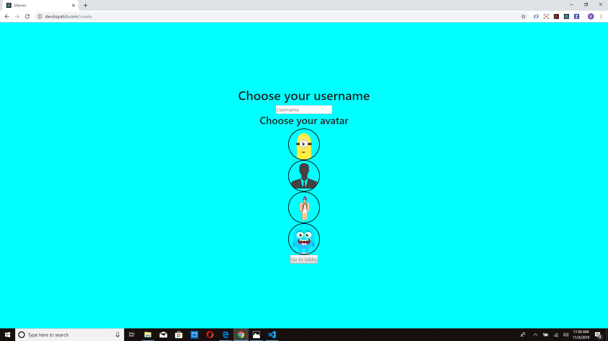

# www.devdispatch.com, An online multiplayer card game similar to "What do you meme", with GIFS instead of pictures.

# www.devdispatch.com, An online multiplayer card game similar to "What do you meme", with GIFS instead of pictures.

## I'll attempt to give you a walkthrough of what this game is, and how it works.

### Why is it called devDispatch... What does that have to do with a card game?

#### Well... I had originally purchased the domain to host a code bootcamp team project, but we never actually got around to hosting it. Since it was sitting dormant, I decided to use it for this, my first post-bootcamp project.

### How does the game work?

#### After a game is started(I'll talk more about how that works in a bit), each user is presented with the same GIF. In addition to a GIF, each user(except the "judge") is given 5 cards with different text (Some examples: When your crush becomes single, When you didnt raise your hand but the teacher called on you anyway, When you realize the song you always skip is actually fire'), and each user that is not the judge picks which card they think goes best with the provided GIF. As players pick their card, the "judge" sees the cards the players picked (In real time with the help of sockets), and picks which card fits best with the GIF. Once the judge chooses the best card, the player who picked that card then becomes the judge, and this repeats until there are no cards left.

### How can I play this game?

#### If you visit www.devDispatch.com, you will be presented with this screen

#### From here you have the option to create or join a game. I am going to give you the walkthrough of how you can create a game. 
### Click on Create Game button to be directed here 

#### As soon as this page loads, a new game object is created and sent to the server.

#### From here you pick a username and avatar (Now, I'll be honest, these don't do anything yet. In the future I plan to add a chatroom where these will come in great handy.)

#### Once you have created a username and selected an avatar, click Go To Lobby (If it is disabled, it is the app requires a username at least 4 characters long.) 