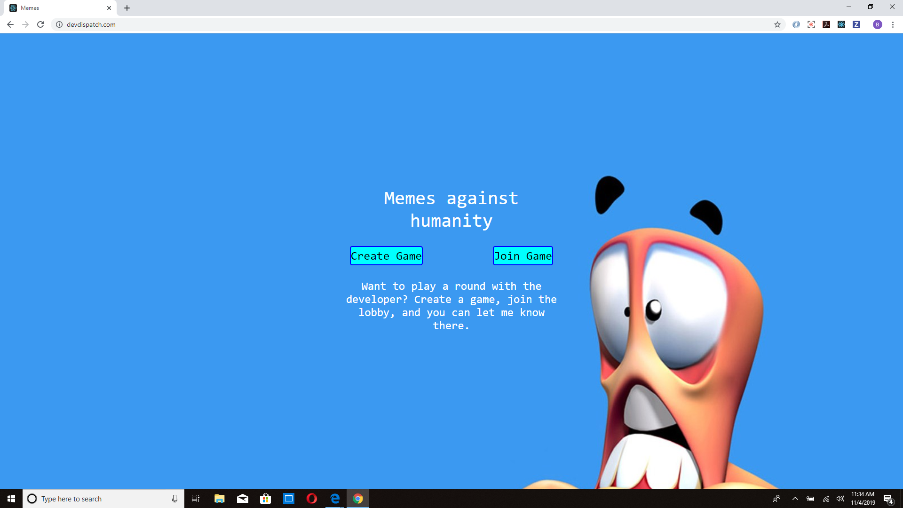

# www.devdispatch.com, An online multiplayer card game similar to "What do you meme", with GIFS instead of pictures.

# www.devdispatch.com, An online multiplayer card game similar to "What do you meme", with GIFS instead of pictures.

## I'll attempt to give you a walkthrough of what this game is, and how it works.

### Why is it called devDispatch... What does that have to do with a card game?

#### Well... I had originally purchased the domain to host a code bootcamp team project, but we never actually got around to hosting it. Since it was sitting dormant, I decided to use it for this, my first post-bootcamp project.

### How does the game work?

#### After a game is started(I'll talk more about how that works in a bit), each user is presented with the same GIF. In addition to a GIF, each user(except the "judge") is given 5 cards with different text (Some examples: When your crush becomes single, When you didnt raise your hand but the teacher called on you anyway, When you realize the song you always skip is actually fire'), and each user that is not the judge picks which card they think goes best with the provided GIF. As players pick their card, the "judge" sees the cards the players picked (In real time with the help of sockets), and picks which card fits best with the GIF. Once the judge chooses the best card, the player who picked that card then becomes the judge, and this repeats until there are no cards left.

### How can I play this game?

#### If you visit www.devDispatch.com, you will be presented with this screen

#### From here you have the option to create or join a game. I am going to give you the walkthrough of how you can create a game. 
### Click on Create Game button to be directed here 

#### As soon as this page loads, a new game object is created and sent to the server.

#### From here you pick a username and avatar (Now, I'll be honest, these don't do anything yet. In the future I plan to add a chatroom where these will come in great handy.)

#### Once you have created a username and selected an avatar, click Go To Lobby (If it is disabled, it is because the app requires a username at least 4 characters long.) 

#### After you have done that, you will be redirected to this page

#### Now the game is ready to accept new users. With that part out of the way, lets take a look at how a user can join this lobby. Take note of the GAME PIN that was generated. Other players will need this to join the lobby.
##### (Also, clicking the link on the bottom will send me a text message telling me the pin of the game that was created, along with the username of the person that sent the invite. This was done though the magic of Twilio.)

#### To get more players in the game, you will have to give this pin to whoever you want to play with you. How you do this is up to you. 

###### Note: This is a prototype for a much better app I plan on releasing on an app store, where you can have friends and invite those friends directly through the app.

### If someone decides they want to play after they have received the pin, they can simply visit the site, click "Join game", and fill out the fields. That page looks like this

### Bam! That user is now part of the lobby, and your page will be updated accordingly. This happens in real time with sockets. 

### Once everybody has joined the game, you, the person who created the game, will be the only person with a "Start Game" button, and will be the judge for the first round. Clicking this button after everybody has joined will take you here.

### Just a gif for now, but as players pick their card, your screen will fill up with the cards that the players chose. 

### This is what the other players will see 

### Once everybody has picked a card, you, the judge, will pick which card fits best with the GIF. The player whose card you chose than becomes the judge, each player gets a new card to replace the one that was used, and each player gets a new GIF(The same gif is shared between everyone in the game).

### Thats it! The game ends once all the GIFS have been used. 
